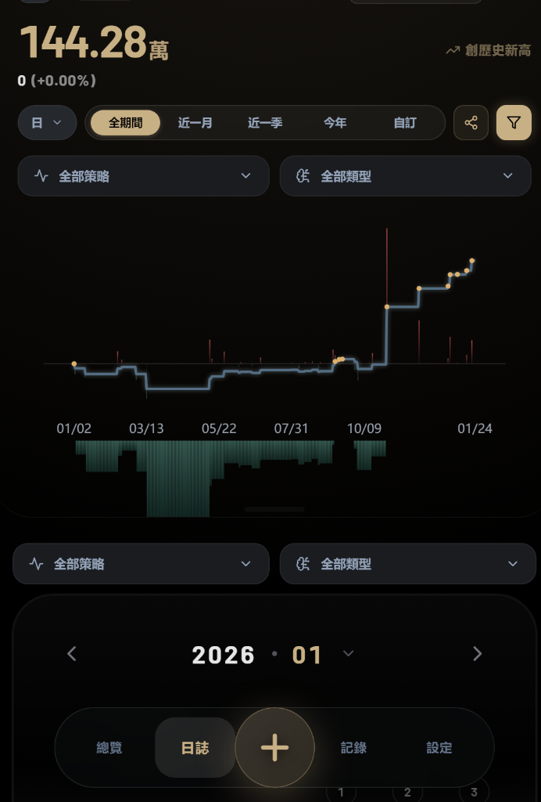
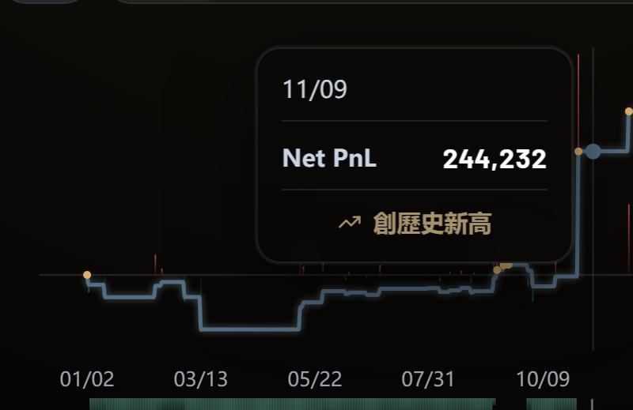
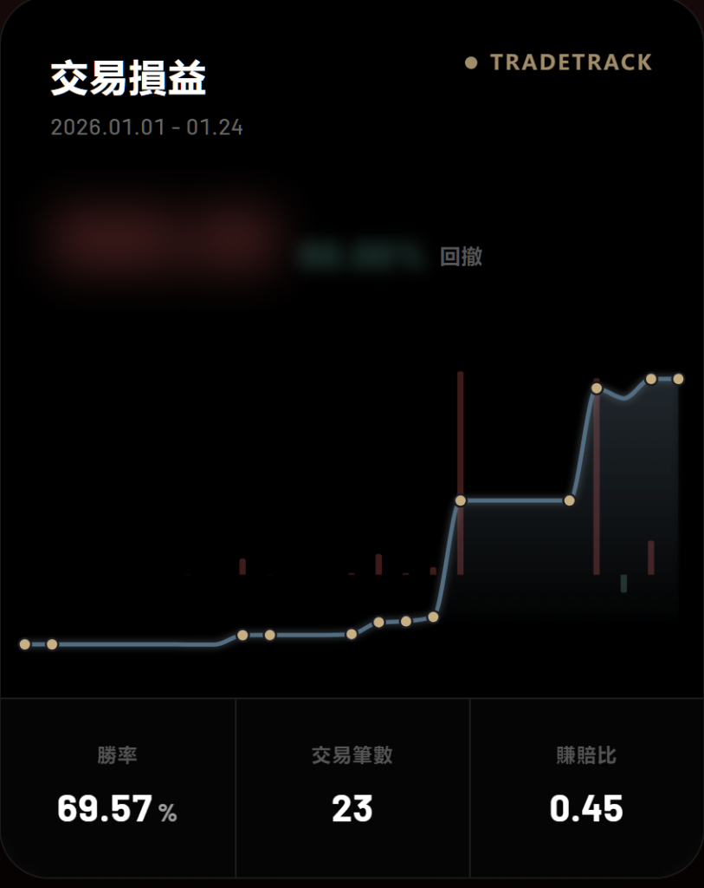
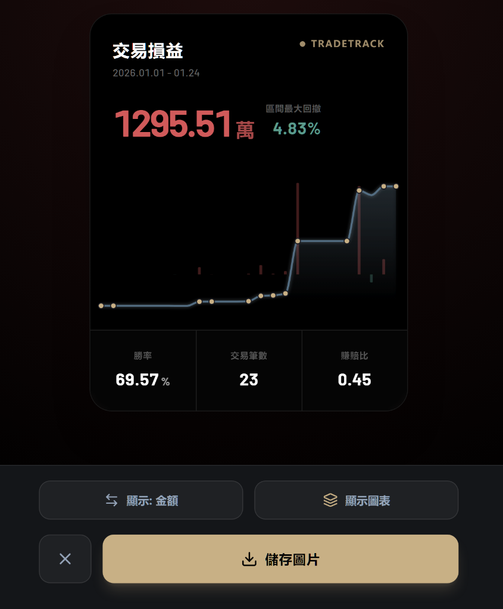

# TradeTrack Pro

<div align="center">
  
  <p align="center">
    
    
    
    
    
    
  </p>
</div>

---

**TradeTrack Pro** 是一款為專業交易者打造的績效追蹤與心理分析儀表板。

採 Mobile-first 與 PWA 設計，本地以 IndexedDB 離線保存資料、雲端透過 Firebase 增量同步至多裝置；後端串接永豐金 Shioaji API，可直接從券商拉取真實成交損益，不必手動鍵入。

## 介面展示

<table style="width: 100%;">
  <tr>
    <td width="50%" align="center"><b>核心儀表板 (Equity Curve)</b><br/></td>
    <td width="50%" align="center"><b>智能圖表提示 (Smart Tooltip)</b><br/></td>
  </tr>
  <tr>
    <td width="50%" align="center"><b>專業隱私模糊 (Privacy Blur)</b><br/></td>
    <td width="50%" align="center"><b>自定義分享介面 (Share Modal)</b><br/></td>
  </tr>
</table>

## 核心功能

### 數據視覺化

- **動態淨值曲線**：可在「純損益 (Pure PnL)」與「含本金淨值 (Equity)」之間切換，平滑過渡。
- **多維度分析**：依策略 (Strategy)、情緒 (Emotion)、投資組合 (Portfolio) 細分績效。
- **完整指標**：Win Rate、Profit Factor、Expectancy、Risk-Reward、Sharpe、最大回撤 (MDD)、連勝連敗、停滯期（未創高天數已內建台股行事曆，自動排除週末與國定假日）。

### 風險預警

- **Drawdown 警報**：回撤達使用者自訂門檻時，自動以紅色視覺警示橫幅提醒。
- **連敗暫停建議**：連續虧損達門檻自動跳出休息提醒，避免情緒交易。

### 隱私

- **全域 Privacy Blur**：一鍵模糊所有金額顯示，公開分享績效卡時保留結構但隱藏絕對數字。
- **Firebase 加密同步**：透過 Google 帳號登入，數據加密傳輸；Web SDK Key 與 App Check / Firestore Rules 配合使用。

### 資料來源

| 方式 | 說明 |
|---|---|
| 手動輸入 | 表單建立／編輯交易紀錄，支援標籤與筆記。 |
| JSON 匯入 | 相容舊版備份，自動偵測重複並提示合併。 |
| 券商同步 | 串接永豐金 Shioaji API，支援多帳號、期貨／證券混合，分塊處理 90 天上限；期貨 SolClient session 自帶 warmup + 指數退避重試，避免 fresh login 撞到 `SessionNotEstablished`。 |

### 同步架構

- **本地**：Dexie / IndexedDB，離線可用、毫秒級讀寫。
- **雲端**：Firestore sub-collection 增量同步——推送只送有變動的 trades，拉取只取 `updatedAt > lastSyncTime` 的差異；游標分頁避免大帳號一次撈光 read quota。
- **軟刪除**：刪除以 `isDeleted: true` 標記，避免跨裝置「殭屍交易」復活。
- **串行化**：雲端推送以 ref 控制單一 in-flight，並發 mutation 自動排隊。

## 頁面

| 頁面 | 路徑 | 主要內容 |
|---|---|---|
| Dashboard | `/` | 核心指標、淨值曲線、策略歸因、分享卡 |
| Journal | `/journal` | 月曆熱力圖、連勝連敗、月度統計 |
| Logs | `/logs` | 交易流水帳、篩選排序、分批 render（避免大列表卡頓） |
| Settings | `/settings` | 券商串接、資料匯出、語系與顯示設定 |

## 技術棧

**前端**

- React 18 · TypeScript 5 · react-router-dom v7
- Vite 5 · vite-plugin-pwa（autoUpdate, Workbox runtime caching）
- Tailwind CSS（Glassmorphism design）· Recharts · Lucide React
- Dexie 4 · dexie-react-hooks（IndexedDB）
- Firebase 10（Auth + Firestore）

**後端**

- Python 3 · Flask · Flask-CORS
- Shioaji SDK（永豐金證券 API）

**Bundle splitting**：`vendor-firebase` / `vendor-charts` / `vendor-canvas` / `vendor-react` / `vendor-db` 各自獨立 chunk；路由級 lazy load，首屏 gzip 約 115 KB。

## 環境需求

- Node.js `>= 20`
- Python `>= 3.10`（僅在需要 Shioaji 同步時）

## 快速開始

### 1. 安裝

```bash
git clone https://github.com/how0531/TradeTrack-Pro.git
cd TradeTrack-Pro
npm install
```

### 2. 設定環境變數

```bash
cp .env.example .env.local
```

在 [Firebase Console](https://console.firebase.google.com) 建立專案後，填入 Web SDK 設定：

```env
# 後端 URL（留空 → 本地 Vite proxy → http://localhost:5000）
VITE_API_URL=

# Firebase Web SDK
VITE_FIREBASE_API_KEY=
VITE_FIREBASE_AUTH_DOMAIN=
VITE_FIREBASE_PROJECT_ID=
VITE_FIREBASE_STORAGE_BUCKET=
VITE_FIREBASE_MESSAGING_SENDER_ID=
VITE_FIREBASE_APP_ID=
VITE_FIREBASE_MEASUREMENT_ID=
```

> Firebase Web Keys 本就會出現在前端 bundle，公開不影響安全。真正的保護來自 **Firestore Security Rules** 與 **App Check**——請至 Firebase Console 啟用。

### 3. 啟動前端

```bash
npm run dev
```

預設 `http://localhost:5173`。

### 4. 啟動後端（選用）

只有需要從券商同步損益時才需要：

```bash
cd backend
pip install -r requirements.txt
python app.py
```

後端預設聽 `:5000`，CORS 預設只允許 `localhost`。生產環境用 `ALLOWED_ORIGINS` env 指定白名單：

```bash
ALLOWED_ORIGINS=https://your-frontend.example.com python app.py
```

**選用 env**：

| Env | 預設 | 用途 |
|---|---|---|
| `ALLOWED_ORIGINS` | `localhost:*` | CORS 白名單，逗號分隔 |
| `LOCAL_DEBUG` | unset | 設 `1` 才寫 `~/debug_backend.log`；雲端部署請保持 unset，依容器 stdout 即可 |

詳細登入流程與錯誤處理請參考 [docs/BACKEND_FLOW.md](./docs/BACKEND_FLOW.md)。

## 部署

前端是靜態 SPA（`dist/`），後端是 Flask 程序（僅券商同步需要）。**Zeabur / Render / Netlify 的設定差異與常見雷（特別是 Zeabur 讀 `zbpack.json` 而非 `zeabur.json` 導致的 502）請務必先看 [docs/DEPLOY.md](./docs/DEPLOY.md)。**

## NPM Scripts

| 指令 | 用途 |
|---|---|
| `npm run dev` | Vite dev server（HMR） |
| `npm run build` | Production build → `dist/` |
| `npm run preview` | 本地預覽 production build |
| `npm test` | Vitest watch mode |
| `npx vitest run` | 一次性跑完所有測試（CI 用） |
| `npm start` | `serve dist`（靜態託管 fallback） |

## 專案結構

```
TradeTrack-Pro/
├── src/
│   ├── App.tsx                  # 路由 + global modals
│   ├── pages/                   # 路由頁面（lazy-loaded）
│   ├── features/                # Domain features（dashboard / calendar / history / trade / settings ...）
│   ├── components/              # 共用元件、modals
│   ├── context/                 # TradeContext / BackendContext / AuthContext
│   ├── hooks/                   # useSync / useMetrics / useIndexedDBData / useAuth ...
│   ├── services/                # firestoreService / brokerService / backendGateway / responseValidators
│   ├── utils/                   # calculations / format / twHolidays（TWSE 行事曆）/ duplicateDetection / haptics ...
│   └── types/                   # 共用型別
├── backend/
│   ├── app.py                   # Flask routes + CORS + stdlib logging
│   └── core/
│       ├── pnl.py               # Shioaji 登入 + PnL 抓取 + 90 天 chunking + SessionNotEstablished 退避 + 時間預算 guard
│       ├── job_store.py         # 非同步同步任務佇列
│       └── session.py           # Singleton session manager + SolClient warmup + 健康檢查
├── public/                      # PWA assets + screenshots
└── .github/workflows/ci.yml     # typecheck / vitest / build
```

## 測試與 CI

- **TypeScript strict** 編譯檢查：`npx tsc --noEmit`
- **Vitest** 單元測試：`npx vitest run`
- **GitHub Actions**：每次 push / PR 對 `main` 自動跑 typecheck → tests → production build

## Changelog

完整變更紀錄請見 [CHANGELOG.md](./CHANGELOG.md)。

---

_Built for traders who seek discipline and edge._
