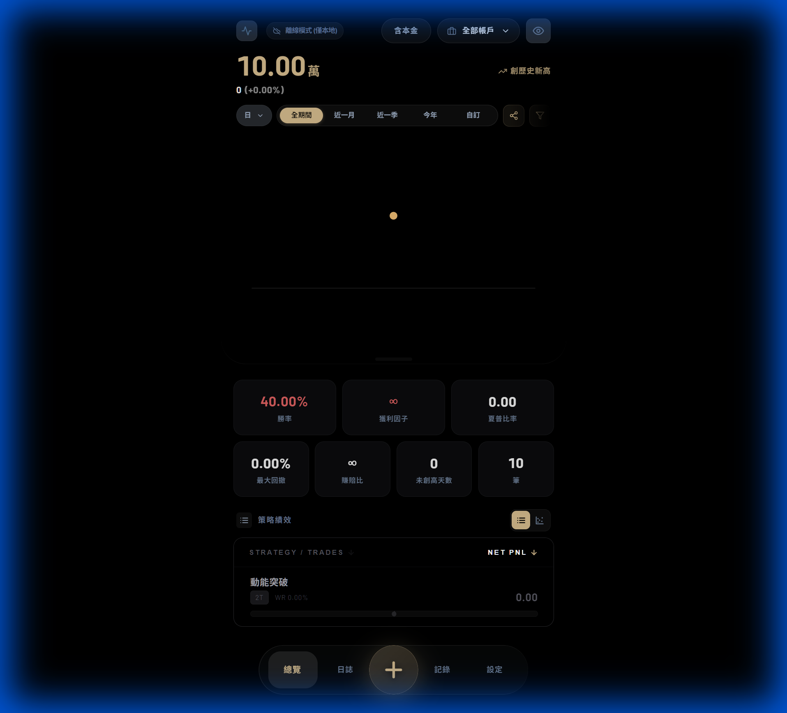
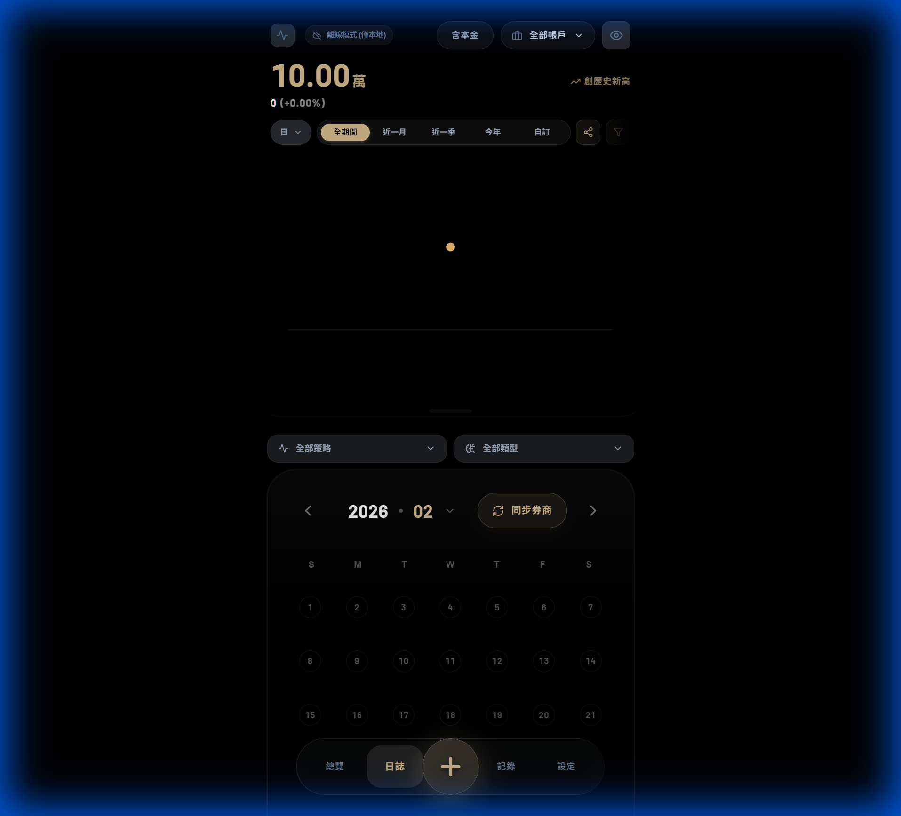
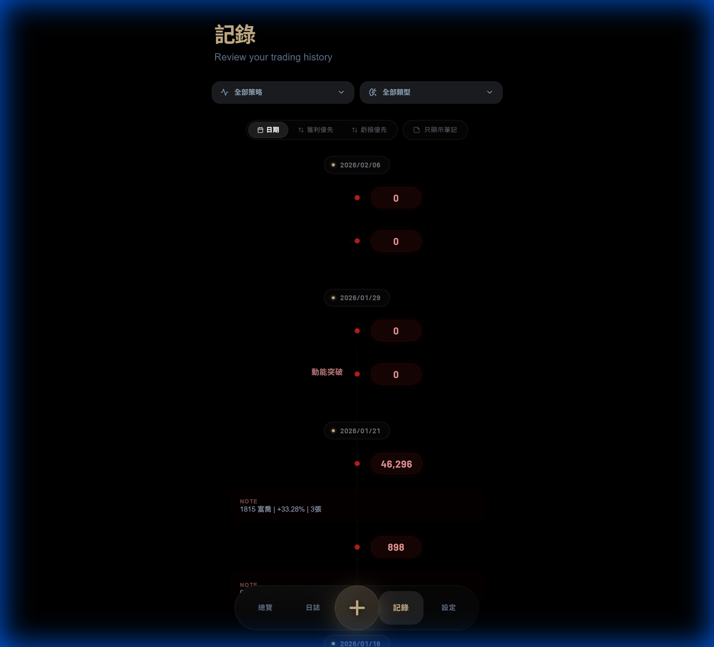
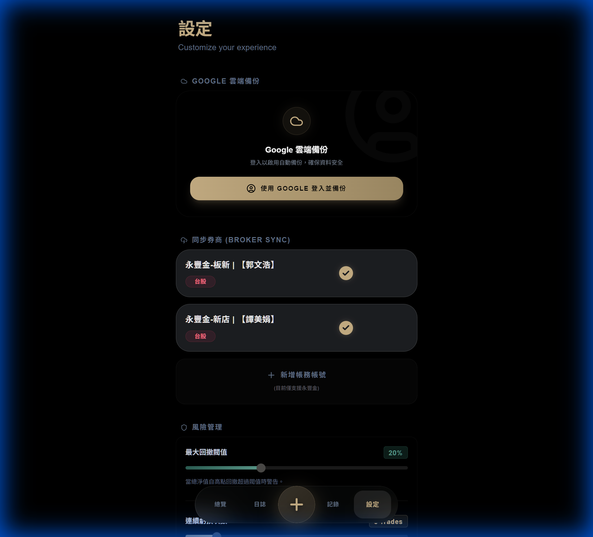

# 📈 TradeTrack Pro

<div align="center">
  
  <p align="center">
    
    
    
    
  </p>
</div>

---

**TradeTrack Pro** 是一款專為專業交易者打造的績效追蹤與心理分析儀表板。不僅能記錄損益，更能透過精準的數據可視化與風險監控，協助您建立穩健的交易系統。

## 📸 介面展示

<table style="width: 100%;">
  <tr>
    <td width="50%" align="center"><b>核心儀表板 (Equity Curve)</b><br/></td>
    <td width="50%" align="center"><b>智能圖表提示 (Smart Tooltip)</b><br/></td>
  </tr>
  <tr>
    <td width="50%" align="center"><b>專業隱私模糊 (Privacy Blur)</b><br/></td>
    <td width="50%" align="center"><b>自定義分享介面 (Share Modal)</b><br/></td>
  </tr>
</table>

## 🌟 核心亮點

### 1. 進階數據可視化

- **動態淨值曲線**：支援「純損益」與「含本金淨值」切換，配備平滑過渡動畫。
- **情緒背景漸層 (Mood Gradient)**：系統根據您的勝率與近期表現，自動調整界面光暈背景。
- **多維度分析**：依策略、心理情緒、投資組合進行細分統計。

### 2. 隱私與安全性

- **全域隱私模式 (Privacy Blur)**：一鍵開啟全域模糊效果，隱藏所有金額顯示。適用於公開分享績效卡片，同時保留數據結構的可讀性。
- **Firebase 實時同步**：數據加密同步至雲端，支援 Google 帳號登入與多裝置無縫切換。

### 3. 風險控管預警

- **Drawdown 警報**：當帳戶回撤達到預設比例時，自動觸發紅色風險視覺警示。
- **連敗暫停建議**：自動偵測連敗次數，提醒交易者適時休息。

### 4. 社交分享系統

- **多樣化視圖**：可切換「純數據」、「圖表」或「完整報告」分享。
- **年份日期統一**：內建美觀的分享卡片模組，全日期格式統一為 `YYYY/MM/DD`。

## 📖 功能頁面 (App Pages)

### 1. 📊 首頁儀表板 (Dashboard)



- **核心指標**: 實時顯示 Win Rate, Profit Factor, Expectancy 等關鍵數據。
- **策略分析**: 針對不同交易策略 (Strategy) 與心理狀態 (Emotion) 進行績效歸因。
- **淨值曲線**: 可視化帳戶淨值成長與回撤 (Drawdown) 狀況。

### 2. 📅 交易日誌 (Journal)



- **月曆視圖**: 直觀呈現每日損益熱力圖 (Heatmap)。
- **連勝連敗**: 自動追蹤目前的連勝/連敗場次 (Streak)，輔助風險控管。

### 3. 📝 歷史紀錄 (Logs)



- **交易流水帳**: 完整的交易列表，支援篩選與排序。
- **編輯管理**: 可快速修改或刪除錯誤的交易紀錄。

### 4. ⚙️ 系統設定 (Settings)



- **券商串接**: 設定 Shioaji API 連線與憑證管理。
- **資料管理**: 執行雲端備份、還原與匯出功能。
- **個人化**: 切換語系 (中/英)、設定停損顯色偏好。

## 🛠 技術棧

- **Frontend**: React (Hooks, Context API)
- **Styling**: Tailwind CSS, Vanilla CSS (Glassmorphism design)
- **Charts**: Recharts (Custom active dots & animations)
- **Icons**: Lucide React
- **Backend**: Firebase Store & Auth
- **Build Tool**: Vite

## 🚀 快速開始

### 環境需求

- Node.js v18.0.0 或更高版本

### 安裝與啟動

1. **Clone 專案**

   ```bash
   git clone https://github.com/how0531/TradeTrack-Pro.git
   cd TradeTrack-Pro
   ```

2. **安裝依賴**

   ```bash
   npm install
   ```

3. **配置環境變數**
   建立 `.env.local` 檔案並填入您的 Firebase 設定：

   ```env
   VITE_FIREBASE_API_KEY=your_api_key
   VITE_FIREBASE_AUTH_DOMAIN=your_auth_domain
   VITE_FIREBASE_PROJECT_ID=your_project_id
   ```

4. **啟動開發環境**
   ```bash
   npm run dev
   ```

### 🔗 永豐金證券 (Shioaji API) 串接

本專案支援原生串接永豐金證券損益資料。如需使用此功能，請先啟動後端服務：

1. **啟動後端**
   進入 `backend` 資料夾並執行 `start.bat`。系統會自動安裝 Python 依賴並啟動 Flask 伺服器。

   如果您希望在電腦關閉時也能運作，請參考 [雲端佈署計畫](./cloud_deployment_plan.md) 將後端佈署至 Render 或 Railway。

   > 📘 **詳細連線流程與錯誤處理**：請參考 [後台連接流程圖](./docs/BACKEND_FLOW.md)。

## 📄 版本更新

詳細變更紀錄請參閱 [CHANGELOG.md](./CHANGELOG.md)。

---

_Developed with ❤️ for traders who seek discipline and edge._
